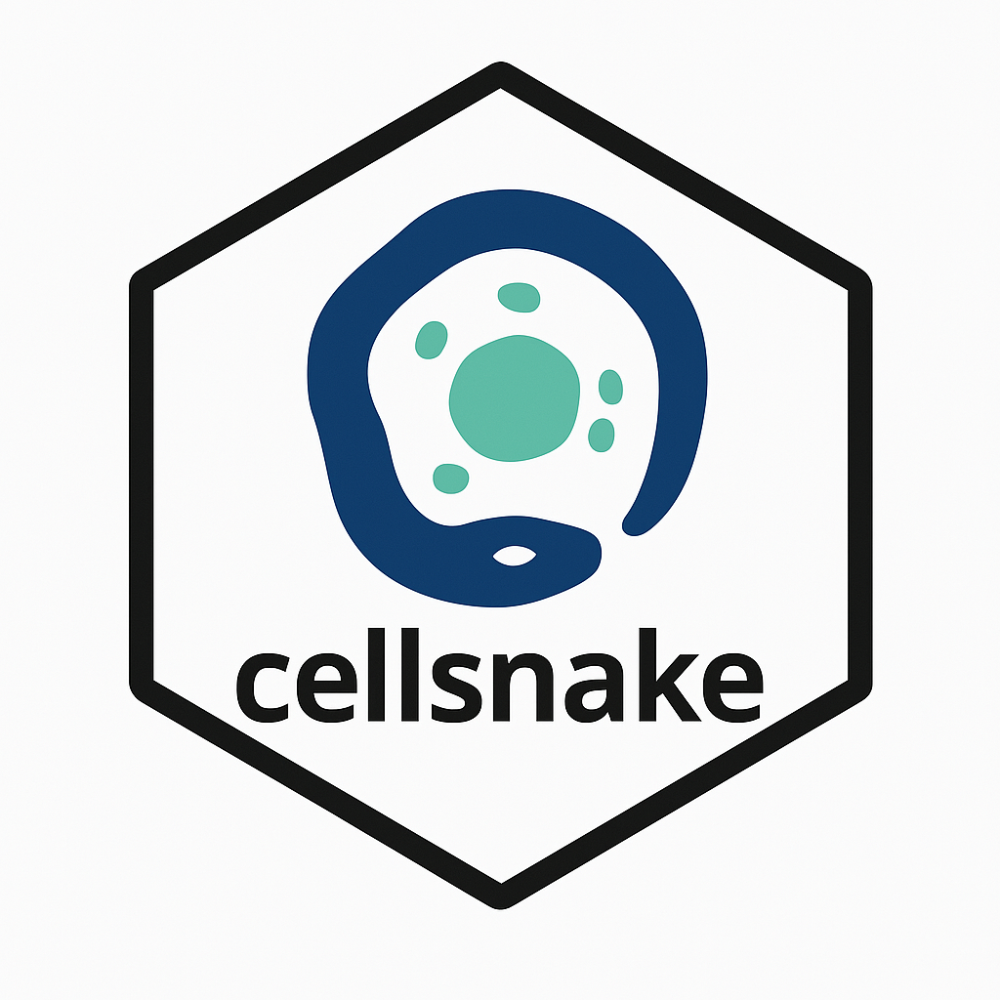
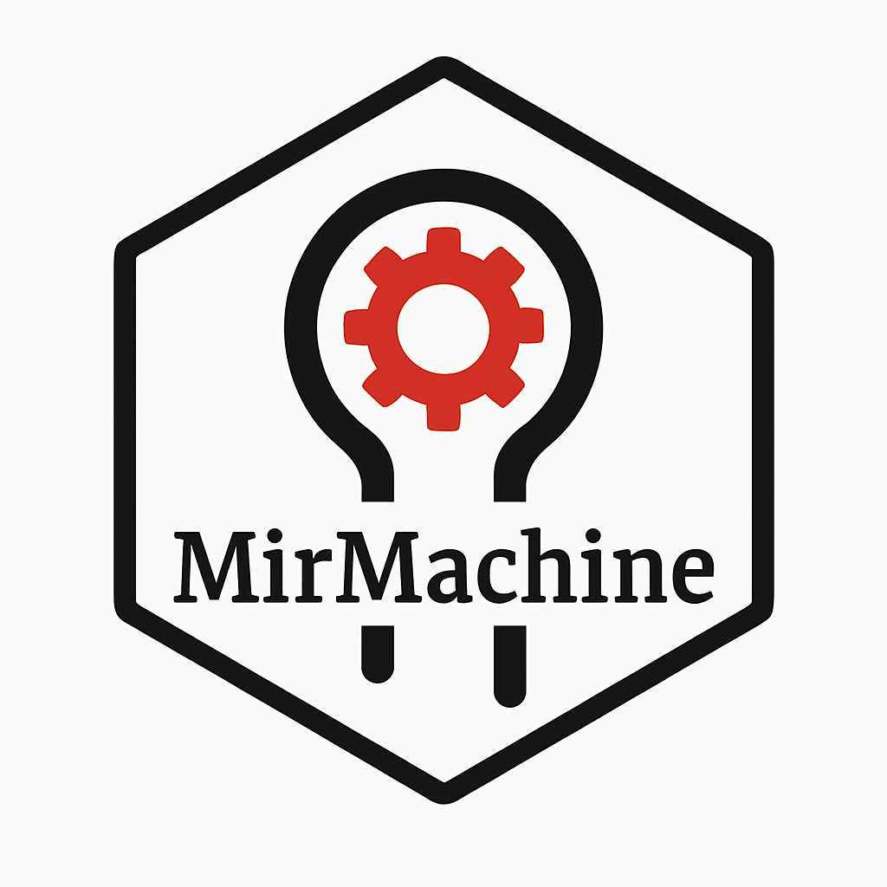

### Hello there 👋

  
  
  

I am a Researcher and senior bioinformatics research scientist at Department of Pathology, Institute of Clinical Medicine, University of Oslo, Norway and working in the [Jahnsen lab](https://jahnsenlab.org/). My job profile at [Klinmed UiO](https://www.med.uio.no/klinmed/english/people/aca/sinanuu/)  

- ⚡ I have been developing open-source bioinformatics tools downloaded by thousands including [MirMachine](https://github.com/sinanugur/MirMachine) and [cellsnake](https://github.com/sinanugur/cellsnake).

- 🔭 My research interests include biostatistics, bioinformatics, molecular epidemiology, spatial transcriptomics, single-cell and bulk RNA sequencing, early detection of cancer using ML and AI, RNA biology of cancer and RNA-RNA interactions.
  
- 🔭 I also have bioinformatics pipelines written in Snakemake (also in Python and R) like a small RNA sequencing pipeline, [sncRNA-workflow](https://github.com/sinanugur/sncRNA-workflow), or a WGS pipeline for HPV variant detection ([TaME-seq](https://github.com/sinanugur/TaME-seq))
  
- 🌱 I completed my doctoral studies in the fields of Biotechnology and Bioinformatics at the University of Canterbury in New Zealand. My research concentrated on the non-coding RNAs in prokaryotic organisms. The primary emphasis of my dissertation was on the interactions between non-coding RNAs and messenger RNAs within the genomes of bacteria and archaea.

<!--
**sinanugur/sinanugur** is a ✨ _special_ ✨ repository because its `README.md` (this file) appears on your GitHub profile.

Here are some ideas to get you started:

- 🔭 I’m currently working on ...
- 🌱 I’m currently learning ...
- 👯 I’m looking to collaborate on ...
- 🤔 I’m looking for help with ...
- 💬 Ask me about ...
- 📫 How to reach me: ...
- 😄 Pronouns: ...
- ⚡ Fun fact: ...
-->
